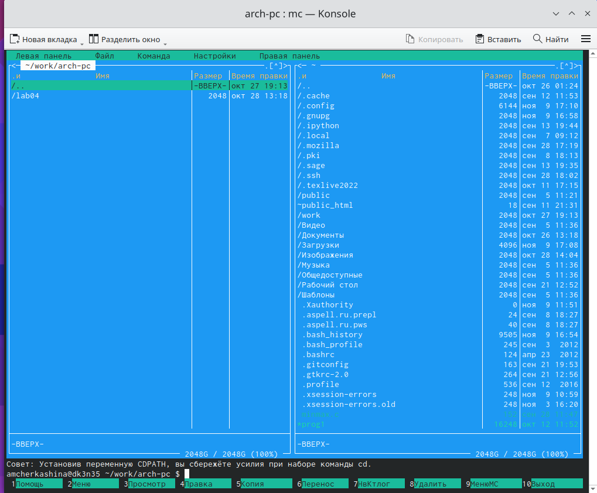

---
## Front matter
title: "Отчёт по лабораторной работе №5"
subtitle: "Дисциплина: архитектура компьютера"
author: "Черкашина Ангелина Максимовна"

## Generic otions
lang: ru-RU
toc-title: "Содержание"

## Bibliography
bibliography: bib/cite.bib
csl: pandoc/csl/gost-r-7-0-5-2008-numeric.csl

## Pdf output format
toc: true # Table of contents
toc-depth: 2
lof: true # List of figures
lot: true # List of tables
fontsize: 12pt
linestretch: 1.5
papersize: a4
documentclass: scrreprt
## I18n polyglossia
polyglossia-lang:
  name: russian
  options:
	- spelling=modern
	- babelshorthands=true
polyglossia-otherlangs:
  name: english
## I18n babel
babel-lang: russian
babel-otherlangs: english
## Fonts
mainfont: PT Serif
romanfont: PT Serif
sansfont: PT Sans
monofont: PT Mono
mainfontoptions: Ligatures=TeX
romanfontoptions: Ligatures=TeX
sansfontoptions: Ligatures=TeX,Scale=MatchLowercase
monofontoptions: Scale=MatchLowercase,Scale=0.9
## Biblatex
biblatex: true
biblio-style: "gost-numeric"
biblatexoptions:
  - parentracker=true
  - backend=biber
  - hyperref=auto
  - language=auto
  - autolang=other*
  - citestyle=gost-numeric
## Pandoc-crossref LaTeX customization
figureTitle: "Рис."
tableTitle: "Таблица"
listingTitle: "Листинг"
lofTitle: "Список иллюстраций"
lotTitle: "Список таблиц"
lolTitle: "Листинги"
## Misc options
indent: true
header-includes:
  - \usepackage{indentfirst}
  - \usepackage{float} # keep figures where there are in the text
  - \floatplacement{figure}{H} # keep figures where there are in the text
---

# Цель работы

Целью данной лабораторной работы является приобретение практических навыков работы в Midnight Commander, освоение инструкций языка ассемблера mov и int.

# Задание

1. Основы работы с mc
2. Структура программы на языке ассемблера NASM
3. Подключение внешнего файла
4. Выполнение заданий для самостоятельной работ

# Теоретическое введение

Midnight Commander (или просто mc) — это программа, которая позволяет просматривать структуру каталогов и выполнять основные операции по управлению файловой системой, т.е. mc является файловым менеджером. Midnight Commander позволяет сделать работу с файлами более удобной и наглядной.
Программа на языке ассемблера NASM, как правило, состоит из трёх секций: секция кода программы (SECTION .text), секция инициированных (известных во время компиляции) данных (SECTION .data) и секция неинициализированных данных (тех, под которые во время компиляции только отводится память, а значение присваивается в ходе выполнения программы) (SECTION .bss).
Для объявления инициированных данных в секции .data используются директивы DB, DW, DD, DQ и DT, которые резервируют память и указывают, какие значения должны храниться в этой памяти:
- DB (define byte) — определяет переменную размером в 1 байт;
- DW (define word) — определяет переменную размеров в 2 байта (слово);
- DD (define double word) — определяет переменную размером в 4 байта (двойное слово);
- DQ (define quad word) — определяет переменную размером в 8 байт (учетве-
рённое слово);
- DT (define ten bytes) — определяет переменную размером в 10 байт. Директивы используются для объявления простых переменных и для объявления массивов. Для определения строк принято использовать директиву DB в связи с особенностями хранения данных в оперативной памяти.
Инструкция языка ассемблера mov предназначена для дублирования данных источника в приёмнике. 
```NASM
mov dst,src
```
Здесь операнд dst — приёмник, а src — источник.
В качестве операнда могут выступать регистры (register), ячейки памяти (memory) и непосредственные значения (const).
Инструкция языка ассемблера intпредназначена для вызова прерывания с указанным номером. 
```NASM
int n
```
Здесь n — номер прерывания, принадлежащий диапазону 0–255. При программировании в Linux с использованием вызовов ядра sys_calls n=80h (принято задавать в шестнадцатеричной системе счисления).

# Выполнение лабораторной работы
## Основы работы с mc

Открываю Midnight Commander, вводя в терминал mc (рис. @fig:001).

{#fig:001 width=70%}

Используя файловый менеджер mc, перехожу в каталог ~/work/arch-pc, созданный при выполнении лабораторной работы №4 (рис. @fig:002).

{#fig:002 width=70%}

С помощью функциональной клавиши F7 создаю папку lab05 (рис. @fig:003).

{#fig:003 width=70%}

Перехожу в созданный каталог(рис. @fig:004).

{#fig:004 width=70%}

В строке ввода прописываю команду touch lab5-1.asm, чтобы создать файл lab5-1.asm, в котором буду работать (рис. @fig:005).

{#fig:005 width=70%}

## Структура программы на языке ассемблера NASM

С помощью функциональной клавиши F4 открываю созданный файл для редактирования во встроенном редакторе mcedit (рис. @fig:006).

{#fig:006 width=70%}

Ввожу в файл код программы вывода сообщения на экран и ввода строки с клавиатуры (рис. @fig:007). Сохраняю изменения и закрываю файл.

{#fig:007 width=70%}

С помощью функциональной клавиши F3 открываю файл lab5-1.asm для просмотра, чтобы убедииться, что файл содержит текст программы (рис. @fig:008).

{#fig:008 width=70%}

Транслирую текст программы файла lab5-1.asm в объектный файл командой nasm -f elf lab5-1.asm. Создался объектный файл lab5-1.o. Выполняю компоновку объектного файла с помощью команды ld -m elf_i386 -o lab5-1 lab5-1.o. Создался исполняемый файл lab5-1 (рис. @fig:009).

{#fig:009 width=70%}

Запускаю получившийся исполняемый файл. Программа выводит строку "Введите строку: " и ожидает ввода с клавиатуры. На запрос я ввожу свои ФИО, на этом программа заканчивает свою работу (рис. @fig:010).

{#fig:010 width=70%}

## Подключение внешнего файла

Скачиваю файл in_out.asm со страницы курса в ТУИС. Он сохранился в каталог Загрузки (рис. @fig:011).

{#fig:011 width=70%}

С помощью функциональной клавиши F5 копирую файл in_out.asm из каталога Загрузки в созданный каталог lab05 (рис. @fig:012).

{#fig:012 width=70%}

С помощью функциональной клавиши F5 создаю копию файла lab5-1 в том же каталоге, но с другим именем (lab5-2.asm). Для этого в появившемся окне mc прописываю путь к копии файла с новым именем (рис. @fig:013).

{#fig:013 width=70%}

Изменяю содержимое файла lab5-2.asm во встроенном редакторе mcedit так, чтобы в программе использовались подпрограммы из внешнего файла in_out.asm (рис. @fig:014).

{#fig:001 width=70%}

Транслирую текст программы файла lab5-2.asm в объектный файл командой nasm -f elf lab5-2.asm. Создался объектный файл lab5-2.o. Выполняю компоновку объектного файла с помощью команды ld -m elf_i386 -o lab5-2 lab5-2.o Создался исполняемый файл lab5-2. Запускаю получившийся исполняемый файл (рис. @fig:015).

{#fig:015 width=70%}

Открываю файл lab5-2.asm для редактирования в mcedit функциональной клавишей F4. Изменяю в нем подпрограмму sprintLF на sprint (рис. @fig:016).

{#fig:016 width=70%}

Сохраняю изменения и открываю файл для просмотра, чтобы проверить корректность сохранения моих действий (рис. @fig:017).

{#fig:017 width=70%}

Снова транслирую текст программы файла в объектный файл, выполняю компоновку созданного объектного файла, получаю исполняемый файл и запускаю его (рис. @fig:018).

{#fig:018 width=70%}

Разница между первым и вторым исполняемыми файлами в том, что запуск первого запрашивает ввод с новой строки, а программа, которая исполняется при запуске второго, запрашивает ввод без переноса на новую строку. В этом заключается различие между подпрограммами sprintLF и sprint.

## Выполнение заданий для самостоятельной работ

1. Создаю копию файла lab5-1.asm с именем lab5-1-1.asm с помощью функциональной клавиши F5 (рис. @fig:019).

{#fig:019 width=70%}

С помощью функциональной клавиши F4 открываю созданный файл для редактирования. Изменяю программу (без использования внешнего файла in_out.asm) так, чтобы кроме вывода приглашения типа "Введите строку:" и запроса ввода строки с клавиатуры она выводила на экран вводимую пользователем строку (рис. @fig:020).

{#fig:020 width=70%}

Открываю файл lab5-1-1.asm для просмотра, чтобы убедиться в корректности внесенных мной изменений (рис. @fig:021).

{#fig:021 width=70%}

2. Создаю объектный файл lab5-1-1.o, отдаю его на обработку компоновщику, получаю исполняемый файл lab5-1-1, запускаю полученный исполняемый файл. Программа запрашивает ввод с новой строки, ввожу свои ФИО. Далее программа выводит введенные мной данные на экран (рис. @fig:022).

{#fig:022 width=70%}

3. Создаю копию файла lab5-2.asm с именем lab5-2-1.asm с помощью функциональной клавиши F5 (рис. @fig:023).

{#fig:023 width=70%}

С помощью функциональной клавиши F4 открываю созданный файл для редактирования. Изменяю программу, используя подпрограммы из внешнего файла in_out.asm так, чтобы кроме вывода приглашения типа "Введите строку:" и запроса ввода строки с клавиатуры она выводила на экран вводимую пользователем строку (рис. @fig:024).

{#fig:024 width=70%}

Открываю файл lab5-2-1.asm для просмотра, чтобы убедиться в корректности внесенных мной изменений (рис. @fig:025).

{#fig:025 width=70%}

4. Создаю объектный файл lab5-2-1.o, отдаю его на обработку компоновщику, получаю исполняемый файл lab5-2-1, запускаю полученный исполняемый файл. Программа запрашивает ввод без переноса на новую строку, ввожу свои ФИО. Далее программа выводит введенные мной данные на экран (рис. @fig:026).

{#fig:026 width=70%}

# Выводы

При выполнении данной лабораторной работы я приобрела практические навыки работы в Midnight Commander, а также освоила инструкции языка ассемблера mov и int.

# Список литературы

1. Архитектура ЭВМ
