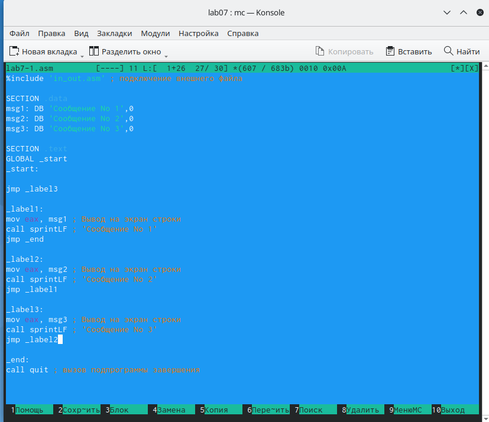

---
## Front matter
title: "Отчёт по лабораторной работе №7"
subtitle: "Дисциплина: архитектура компьютера"
author: "Черкашина Ангелина Максимовна"

## Generic otions
lang: ru-RU
toc-title: "Содержание"

## Bibliography
bibliography: bib/cite.bib
csl: pandoc/csl/gost-r-7-0-5-2008-numeric.csl

## Pdf output format
toc: true # Table of contents
toc-depth: 2
lof: true # List of figures
lot: true # List of tables
fontsize: 12pt
linestretch: 1.5
papersize: a4
documentclass: scrreprt
## I18n polyglossia
polyglossia-lang:
  name: russian
  options:
	- spelling=modern
	- babelshorthands=true
polyglossia-otherlangs:
  name: english
## I18n babel
babel-lang: russian
babel-otherlangs: english
## Fonts
mainfont: PT Serif
romanfont: PT Serif
sansfont: PT Sans
monofont: PT Mono
mainfontoptions: Ligatures=TeX
romanfontoptions: Ligatures=TeX
sansfontoptions: Ligatures=TeX,Scale=MatchLowercase
monofontoptions: Scale=MatchLowercase,Scale=0.9
## Biblatex
biblatex: true
biblio-style: "gost-numeric"
biblatexoptions:
  - parentracker=true
  - backend=biber
  - hyperref=auto
  - language=auto
  - autolang=other*
  - citestyle=gost-numeric
## Pandoc-crossref LaTeX customization
figureTitle: "Рис."
tableTitle: "Таблица"
listingTitle: "Листинг"
lofTitle: "Список иллюстраций"
lotTitle: "Список таблиц"
lolTitle: "Листинги"
## Misc options
indent: true
header-includes:
  - \usepackage{indentfirst}
  - \usepackage{float} # keep figures where there are in the text
  - \floatplacement{figure}{H} # keep figures where there are in the text
---

# Цель работы

Целью данной лабораторной работы является изучение команд условного и безусловного переходов, приобретение навыков написания программ с использованием переходов, знакомство с назначением и структурой файла листинга.

# Задание

1. Реализация переходов в NASM
2. Изучение структуры файла листинга
3. Выполнение заданий для самостоятельной работы

# Теоретическое введение

Для реализации ветвлений в ассемблере используются так называемые команды передачи управления или команды перехода. Можно выделить 2 типа переходов:

• условный переход – выполнение или не выполнение перехода в определенную точку программы в зависимости от проверки условия.

• безусловный переход – выполнение передачи управления в определенную точку программы без каких-либо условий.

Безусловный переход выполняется инструкцией jmp. Инструкция cmp является одной из инструкций, которая позволяет сравнить операнды и выставляет флаги в зависимости от результата сравнения.
Инструкция cmp является командой сравнения двух операндов и имеет такой же формат, как и команда вычитания.

Листинг (в рамках понятийного аппарата NASM) — это один из выходных файлов, создаваемых транслятором. Он имеет текстовый вид и нужен при отладке программы, так как кроме строк самой программы он содержит дополнительную информацию.

# Выполнение лабораторной работы
## Реализация переходов в NASM

Создаю каталог для программ лабораторной работы № 7, перехожу в него и создаю файл lab7-1.asm с помощью команды touch (рис. @fig:001).

{#fig:001 width=70%}

С помощью команды cp копирую в текущий каталог файл in_out.asm, т.к. он будет использоваться в других программах (рис. @fig:002).

{#fig:002 width=70%}

Открываю файл lab7-1.asm для редактирования и ввожу в него текст программы с использованием инструкции jmp в соответствии с листингом 7.1 (рис. @fig:003).

{#fig:003 width=70%}

Создаю исполняемый файл и запускаю его (рис. @fig:004).

{#fig:004 width=70%}

Таким образом, использование инструкции jmp _label2 меняет порядок исполнения
инструкций и позволяет выполнить инструкции начиная с метки _label2, пропустив вывод
первого сообщения.

Изменю программу таким образом, чтобы она выводила сначала ‘Сообщение № 2’, потом ‘Сообщение № 1’ и завершала работу. Для этого изменяю текст программы в соответствии с листингом 7.2 (рис. @fig:005).

{#fig:005 width=70%}

Создаю исполняемый файл и проверяю его работу (рис. @fig:006).

{#fig:006 width=70%}

Далее изменяю текст программы так, чтобы она выводила сначала ‘Сообщение № 3’, потом ‘Сообщение № 2’, а затем ‘Сообщение № 1’ и завершала работу. Для этого добавляю jmp _label3 в начале программы и jmp _label2 в конце метки _label3 (рис. @fig:007).

{#fig:007 width=70%}

Создаю исполняемый файл и проверяю его работу (рис. @fig:008).

{#fig:008 width=70%}

Создаю файл lab7-2.asm в каталоге ~/work/arch-pc/lab07 (рис. @fig:009).

{#fig:009 width=70%}

Открываю файл lab7-2.asm для редактирования и ввожу в него текст программы, которая определяет и выводит на экран наибольшую из 3 целочисленных переменных: A, B и C (в соответствии с листингом 7.3) (рис. @fig:010).

{#fig:010 width=70%}

Создаю исполняемый файл, запускаю его, вводя сначала одно значение B (рис. @fig:011), а затем другое (рис. @fig:012).

{#fig:011 width=70%}

{#fig:012 width=70%}

## Изучение структуры файла листинга

Создаю файл листинга для программы из файла lab7-2.asm (рис. @fig:013).

{#fig:013 width=70%}

Открываю файл листинга lab7-2.lst с помощью текстового редактора gedit и внимательно изучаю его формат и содержимое (рис. @fig:014).

{#fig:014 width=70%}

В трех представленных строках (рис. @fig:015) содержатся следующие данные:

"2" - номер строки кода, "; Функция вычисления длинны сообщения" - комментарий к коду, не имеет адреса и машинного кода.

"3" - номер строки кода, "slen" - название функции, не имеет адреса и машинного кода.

"4" - номер строки кода, "00000000" - адрес строки, "53" - машинный код, "push ebx" - исходный текст программы, инструкция "push" помещает операнд "ebx" в стек.

{#fig:015 width=70%}

Открываю файл с программой lab7-2.asm и в выбранной мной инструкции с двумя операндами удаляю выделенный операнд (рис. @fig:016).

{#fig:016 width=70%}

Выполняю трансляцию с получением файла листинга (рис. @fig:017).

{#fig:017 width=70%}

На выходе я не получаю ни одного файла из-за ошибки: инструкция cmp не может работать, имея только один операнд, из-за чего нарушается работа кода.

## Выполнение заданий для самостоятельной работы

1. С помощью команды touch создаю файл lab7-3.asm для выполнения самостоятельного задания №1 (вариант 11) (рис. @fig:018).

{#fig:018 width=70%}

В созданном файле пишу программу нахождения наименьшей из 3 целочисленных переменных a, b и c. Значения переменных беру из таблицы 7.5 в соответствии с вариантом, полученным мной при выполнении лабораторной работы № 6. Мой вариант под номером 11, поэтому мои значения - 21, 28, 34 (рис. @fig:019).

{#fig:019 width=70%}

Создаю исполняемый файл и проверяю его работу (рис. @fig:020).

{#fig:020 width=70%}

Программа работает корректно.

**Листинг 4.1. Программа нахождения наименьшей целочисленной переменной**

```NASM

%include 'in_out.asm'
section .data
msg db "Наименьшее число: ",0h
A dd '21'
B dd '28'
C dd '34'
section .bss
min resb 10
section .text
global _start
_start:
; ---------- Записываем 'A' в переменную 'min'
mov ecx,[A] ; 'ecx = A'
mov [min],ecx ; 'min = A'
; ---------- Сравниваем 'A' и 'С' (как символы)
cmp ecx,[C] ; Сравниваем 'A' и 'С'
jl check_B ; если 'A<C', то переход на метку 'check_B',
mov ecx,[C] ; иначе 'ecx = C'
mov [min],ecx ; 'min = C'
; ---------- Преобразование 'min(A,C)' из символа в число
check_B:
mov eax,min
call atoi ; Вызов подпрограммы перевода символа в число
mov [min],eax ; запись преобразованного числа в min
; ---------- Сравниваем 'min(A,C)' и 'B' (как числа)
mov ecx,[min]
cmp ecx,[B] ; Сравниваем 'min(A,C)' и 'B'
jl fin ; если 'min(A,C)< B', то переход на 'fin',
mov ecx,[B] ; иначе 'ecx = B'
mov [min],ecx
; ---------- Вывод результата
fin:
mov eax, msg
call sprint ; Вывод сообщения 'Наименьшее число: '
mov eax,[min]
call iprintLF ; Вывод 'min(A,B,C)'
call quit ; Выход

```

2. С помощью команды touch создаю файл lab7-4.asm для выполнения самостоятельного задания №2 (вариант 11) (рис. @fig:021).

{#fig:021 width=70%}

Пишу программу, которая для введенных с клавиатуры значений x и a вычисляет значение заданной функции f(x) и выводит результат вычислений (рис. @fig:022).

Мой вариант 11, поэтому я пишу программу для следующей функции:

4*a, x=0

4*a+x, x!=0

{#fig:022 width=70%}

Создаю исполняемы файл и проверяю его работу для следующих значений x и a соответственно: (0;3) и (1;2) (рис. @fig:023).

{#fig:023 width=70%}

Программа работает корректно.

**Листинг 4.2. Программа вычисления значения функции f(x)**

```NASM

%include 'in_out.asm'

SECTION .data
msg1: DB "Введите x: ",0h
msg2: DB "Введите a: ",0h
msg3: DB "Результат: ",0h

SECTION .bss
x: RESB 80
a: RESB 80

SECTION .text
GLOBAL _start
_start:

mov eax, msg1
call sprintLF

mov ecx, x
mov edx, 80
call sread

mov eax, x
call atoi
mov [x], eax
cmp eax, 0
je _functiona

jmp _functionax

_functiona:
mov eax, msg2
call sprintLF
mov ecx, a
mov edx, 80
call sread
mov eax, a
call atoi
mov edx, 4
mul edx
mov edi, eax
jmp _end

_functionax:
mov eax, msg2
call sprintLF
mov ecx, a
mov edx, 80
call sread
mov eax, a
call atoi
mov edx, 4
mul edx
mov edx, [x]
add eax, edx
mov edi, eax
jmp _end

_end:
mov ecx, eax
mov eax, msg3
call sprint
mov eax, edi
call iprintLF
call quit

```

# Выводы

При выполнении данной лабораторной работы я изучила команды условного и безусловного переходов, приобрела навыки написания программ с использованием переходов и ознакомилась с назначением и структурой файла листинга.

# Список литературы

1. Архитектура ЭВМ
