---
## Front matter
title: "Отчёт по лабораторной работе №8"
subtitle: "Дисциплина: архитектура компьютера"
author: "Черкашина Ангелина Максимовна"

## Generic otions
lang: ru-RU
toc-title: "Содержание"

## Bibliography
bibliography: bib/cite.bib
csl: pandoc/csl/gost-r-7-0-5-2008-numeric.csl

## Pdf output format
toc: true # Table of contents
toc-depth: 2
lof: true # List of figures
lot: true # List of tables
fontsize: 12pt
linestretch: 1.5
papersize: a4
documentclass: scrreprt
## I18n polyglossia
polyglossia-lang:
  name: russian
  options:
	- spelling=modern
	- babelshorthands=true
polyglossia-otherlangs:
  name: english
## I18n babel
babel-lang: russian
babel-otherlangs: english
## Fonts
mainfont: PT Serif
romanfont: PT Serif
sansfont: PT Sans
monofont: PT Mono
mainfontoptions: Ligatures=TeX
romanfontoptions: Ligatures=TeX
sansfontoptions: Ligatures=TeX,Scale=MatchLowercase
monofontoptions: Scale=MatchLowercase,Scale=0.9
## Biblatex
biblatex: true
biblio-style: "gost-numeric"
biblatexoptions:
  - parentracker=true
  - backend=biber
  - hyperref=auto
  - language=auto
  - autolang=other*
  - citestyle=gost-numeric
## Pandoc-crossref LaTeX customization
figureTitle: "Рис."
tableTitle: "Таблица"
listingTitle: "Листинг"
lofTitle: "Список иллюстраций"
lotTitle: "Список таблиц"
lolTitle: "Листинги"
## Misc options
indent: true
header-includes:
  - \usepackage{indentfirst}
  - \usepackage{float} # keep figures where there are in the text
  - \floatplacement{figure}{H} # keep figures where there are in the text
---

# Цель работы

Целью данной лабораторной работы является приобретение навыков написания программ с использованием циклов и обработкой аргументов командной строки.

# Задание

1. Реализация циклов в NASM
2. Обработка аргументов командной строки
3. Выполнение задания для самостоятельной работы

# Теоретическое введение

Стек — это структура данных, организованная по принципу LIFO («Last In — First Out» или «последним пришёл — первым ушёл»). Стек является частью архитектуры процессора и реализован на аппаратном уровне. Для работы со стеком в процессоре есть специальные регистры (ss, bp, sp) и команды.
Основной функцией стека является функция сохранения адресов возврата и передачи аргументов при вызове процедур. Кроме того, в нём выделяется память для локальных переменных и могут временно храниться значения регистров.
Стек имеет вершину, адрес последнего добавленного элемента, который хранится в регистре esp (указатель стека). Противоположный конец стека называется дном. Значение, помещённое в стек последним, извлекается первым. При помещении значения в стек указатель стека уменьшается, а при извлечении — увеличивается.

Для стека существует две основные операции:
• добавление элемента в вершину стека (push);
• извлечение элемента из вершины стека (pop).

Команда push размещает значение в стеке, т.е. помещает значение в ячейку памяти, на которую указывает регистр esp, после этого значение регистра esp увеличивается на 4. Данная команда имеет один операнд — значение, которое необходимо поместить в стек.

Команда pop извлекает значение из стека, т.е. извлекает значение из ячейки памяти, на которую указывает регистр esp, после этого уменьшает значение регистра esp на 4. У этой команды также один операнд, который может быть регистром или переменной в памяти.
Нужно помнить, что извлечённый из стека элемент не стирается из памяти и остаётся как “мусор”, который будет перезаписан при записи нового значения в стек.

Для организации циклов существуют специальные инструкции. Для всех инструкций максимальное количество проходов задаётся в регистре ecx. Наиболее простой является инструкция loop. Она позволяет организовать безусловный цикл.
Иструкция loop выполняется в два этапа. Сначала из регистра ecx вычитается единица и его значение сравнивается с нулём. Если регистр не равен нулю, то выполняется переход к указанной метке. Иначе переход не выполняется и управление передаётся команде, которая следует сразу после команды loop.

# Выполнение лабораторной работы

## Реализация циклов в NASM

Создаю каталог для программ лабораторной работы №8 с помощью команды mkdir, перехожу в него и создаю файл lab8-1.asm с помощью команды touch (рис. @fig:001).

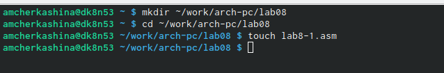{#fig:001 width=70%}

С помощью команды cp копирую в текущий каталог файл in_out.asm, т.к. он будет использоваться в программах данной лабораторной работы (рис. @fig:002).

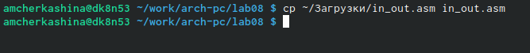{#fig:002 width=70%}

Ввожу в файл lab8-1.asm текст программы вывода значений регистра ecx из листинга 8.1 (рис. @fig:003).

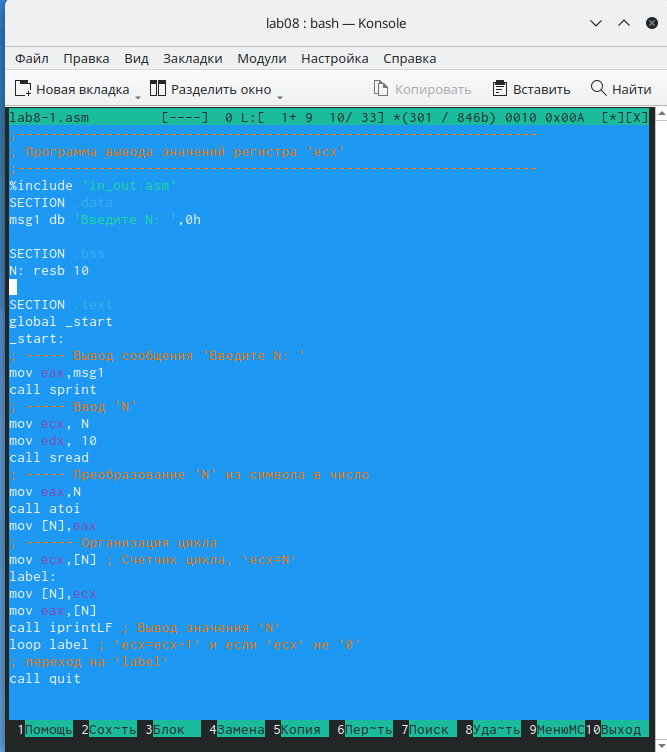{#fig:003 width=70%}

Создаю исполняемый файл и запускаю его (рис. @fig:004).

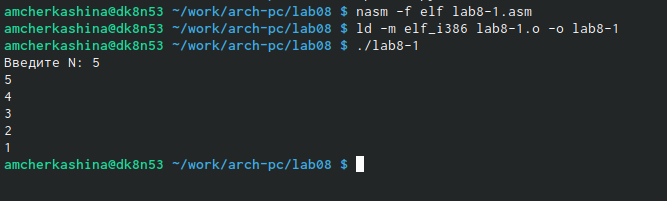{#fig:004 width=70%}

Данная программа выводит числа от N до 1 включительно.

Изменяю текст программы, добавив изменение значения регистра ecx в цикле (рис. @fig:005).

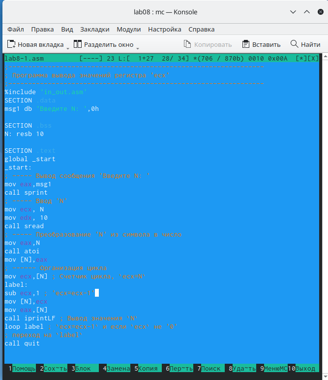{#fig:005 width=70%}

Создаю исполняемый файл и проверяю его работу (рис. @fig:006).

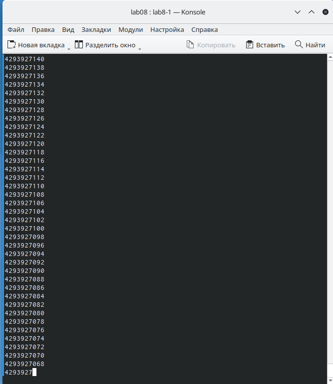{#fig:006 width=70%}

В данном случае число проходов цикла не соответствует введенному с клавиатуры значению N.

Вношу изменения в текст программы, добавив команды push и pop (добавления в стек и извлечения из стека) для сохранения значения счетчика цикла loop (рис. @fig:007).

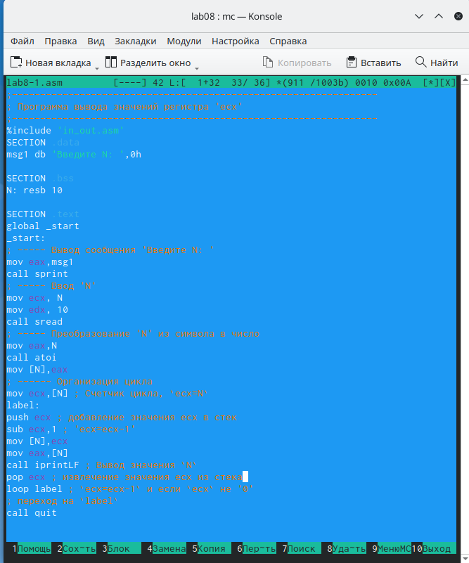{#fig:007 width=70%}

Создаю исполняемый файл и проверяю его работу (рис. @fig:008).

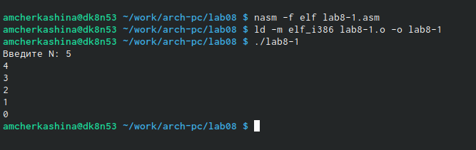{#fig:008 width=70%}

В данном случае число проходов цикла соответствует введенному с клавиатуры значению и выводит числа от N-1 до 0 включительно.

## Обработка аргументов командной строки

Создаю файл lab8-2.asm в каталоге ~/work/arch-pc/lab08 с помощью команды touch (рис. @fig:009).

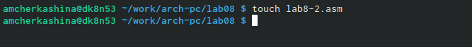{#fig:009 width=70%}

Ввожу в него текст программы, выводящей на экран аргументы командной строки, из листинга 8.2 (рис. @fig:010).

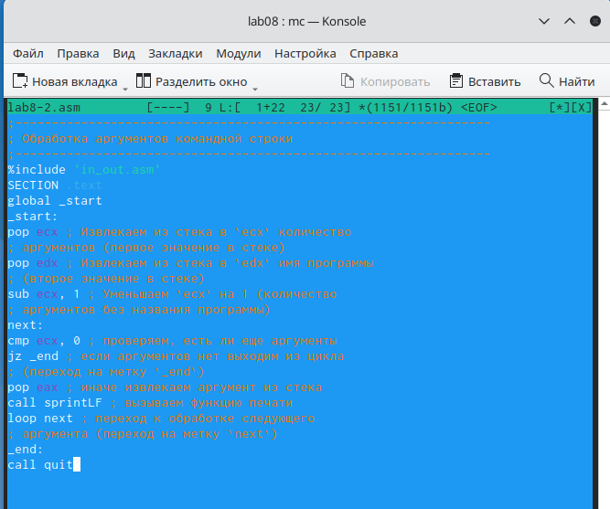{#fig:010 width=70%}

Создаю исполняемый файл и запускаю его, указав следующие аргументы: аргумент1 аргумент 2 'аргумент 3' (рис. @fig:011).

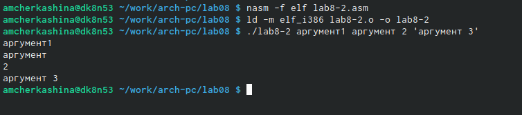{#fig:011 width=70%}

Программа обработала и вывела 4 аргумента. Так как аргумент 2 не был взят в кавычки, в отличии от 'аргумент 3', из-за наличия пробела программа считывает "2" как отдельный аргумент.

Создаю файл lab8-3.asm в каталоге ~/work/arch-pc/lab08 с помощью команды touch (рис. @fig:012).

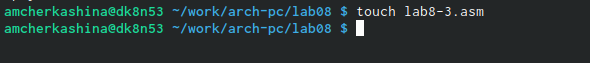{#fig:012 width=70%}

Ввожу в него текст программы вычисления суммы аргументов командной строки из листинга 8.3 (рис. @fig:013).

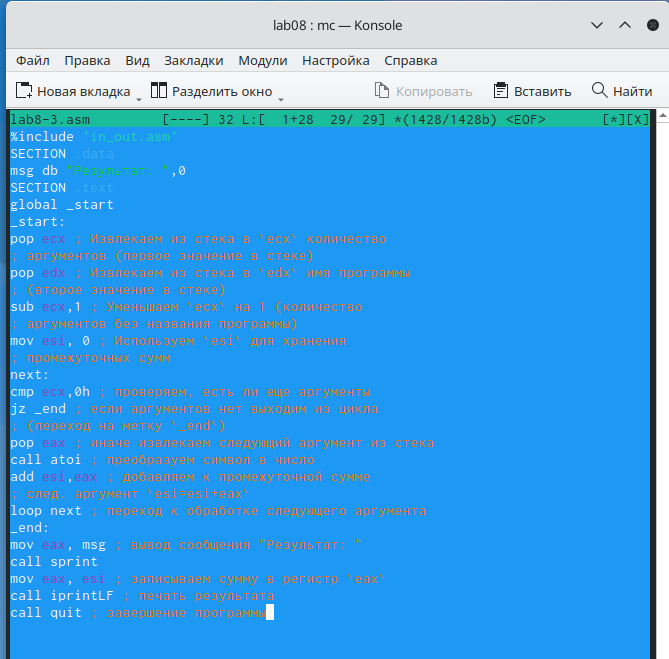{#fig:013 width=70%}

Создаю исполняемый файл и запускаю его, указав аргументы (рис. @fig:014).

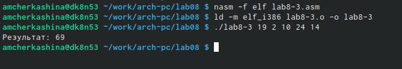{#fig:014 width=70%}

Изменяю текст программы из листинга 8.3 для вычисления произведения аргументов командной строки. Для этого изменяю изначальное значение счетчика на 1, а add на mul (рис. @fig:015).

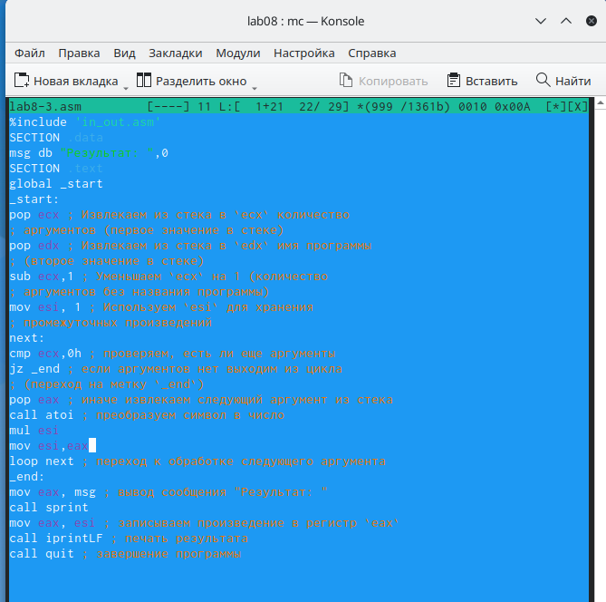{#fig:015 width=70%}

Создаю исполняемый файл и запускаю его, указав аргументы (рис. @fig:016).

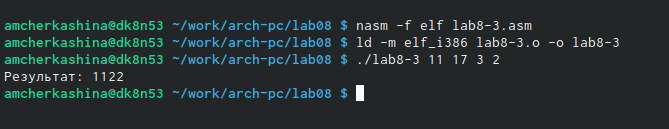{#fig:016 width=70%}

**Листинг 4.1. Программа вычисления произведения аргументов командной строки**

```NASM
%include 'in_out.asm'
SECTION .data
msg db "Результат: ",0
SECTION .text
global _start
_start:
pop ecx ; Извлекаем из стека в `ecx` количество
; аргументов (первое значение в стеке)
pop edx ; Извлекаем из стека в `edx` имя программы
; (второе значение в стеке)
sub ecx,1 ; Уменьшаем `ecx` на 1 (количество
; аргументов без названия программы)
mov esi, 1 ; Используем `esi` для хранения
; промежуточных произведений
next:
cmp ecx,0h ; проверяем, есть ли еще аргументы
jz _end ; если аргументов нет выходим из цикла
; (переход на метку `_end`)
pop eax ; иначе извлекаем следующий аргумент из стека
call atoi ; преобразуем символ в число
mul esi
mov esi,eax
loop next ; переход к обработке следующего аргумента
_end:
mov eax, msg ; вывод сообщения "Результат: "
call sprint
mov eax, esi ; записываем произведение в регистр `eax`
call iprintLF ; печать результата
call quit ; завершение программы
```

## Выполнение задания для самостоятельной работы

Пишу текст программы, которая находит сумму значений функции f(x) для x = x1, x2, ..., xn, т.е. программу, выводящую значения f(x1) + f(x2) + ... + f(xn). Значения xi передаются как аргументы. Вид функции f(x) выбираю из таблицы 8.1 вариантов заданий в соответствии с вариантом, полученным мной при выполнении лабораторной работы №6.

Мой вариант 11, соответственно пишу программу нахождения суммы значений функции f(x) = 15*x + 2 (рис. @fig:017).

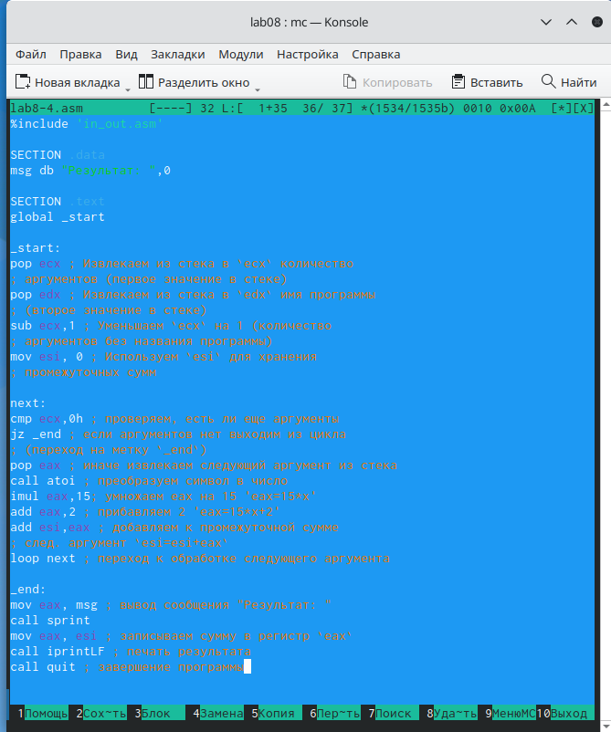{#fig:017 width=70%}

Создаю исполняемый файл и проверяю его работу на нескольких наборах x = x1, x2, ..., xn (рис. @fig:018).

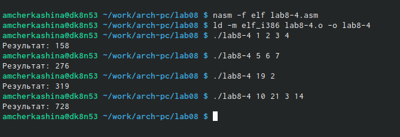{#fig:018 width=70%}

Программа работает корректно.

**Листинг 4.2. Программа нахождения суммы значений функции f(x) = 15*x + 2**

```NASM
%include 'in_out.asm'

SECTION .data
msg db "Результат: ",0

SECTION .text
global _start

_start:
pop ecx ; Извлекаем из стека в `ecx` количество
; аргументов (первое значение в стеке)
pop edx ; Извлекаем из стека в `edx` имя программы
; (второе значение в стеке)
sub ecx,1 ; Уменьшаем `ecx` на 1 (количество
; аргументов без названия программы)
mov esi, 0 ; Используем `esi` для хранения
; промежуточных сумм

next:
cmp ecx,0h ; проверяем, есть ли еще аргументы
jz _end ; если аргументов нет выходим из цикла
; (переход на метку `_end`)
pop eax ; иначе извлекаем следующий аргумент из стека
call atoi ; преобразуем символ в число
imul eax,15; умножаем eax на 15 'eax=15*x'
add eax,2 ; прибавляем 2 'eax=15*x+2'
add esi,eax ; добавляем к промежуточной сумме
; след. аргумент `esi=esi+eax`
loop next ; переход к обработке следующего аргумента

_end:
mov eax, msg ; вывод сообщения "Результат: "
call sprint
mov eax, esi ; записываем сумму в регистр `eax`
call iprintLF ; печать результата
call quit ; завершение программы
```

# Выводы

При выполнении данной лабораторной работы я приобрела навыки написания программ с использованием циклов и обработкой аргументов командной строки.

# Список литературы

1. Архитектура ЭВМ
